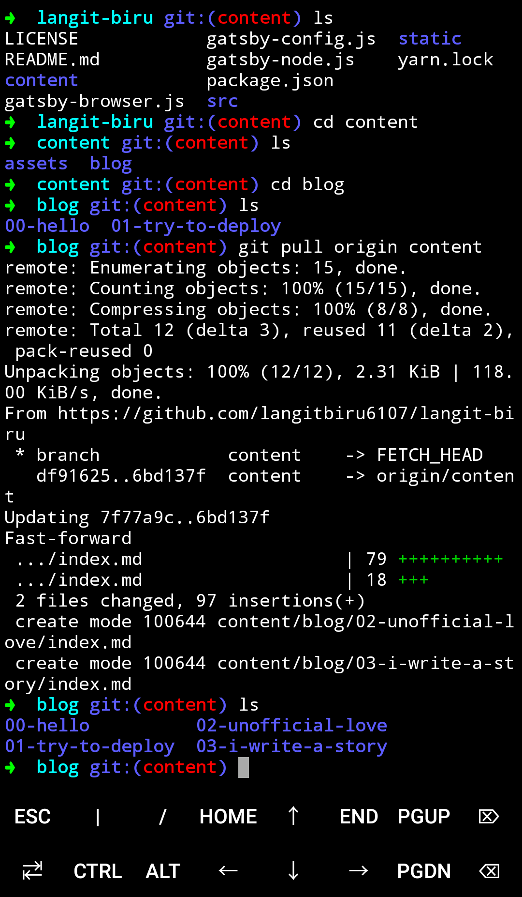
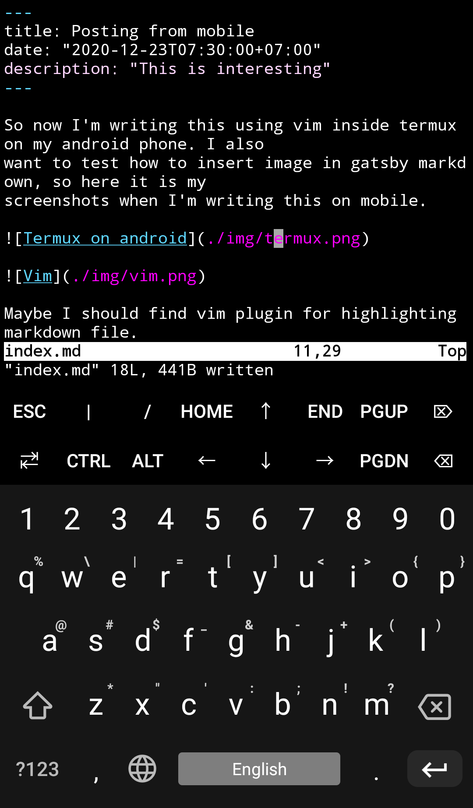

So now I'm writing this using vim inside termux on my android phone. I also
want to test how to insert image in gatsby markdown, so here it is my
screenshots when I'm writing this on mobile.

Maybe I should find vim plugin for highlighting markdown file.

And yeah, next website release there will be a huge change in routing and
categorization. Some change is already pushed to `master` branch.

So far so good!
